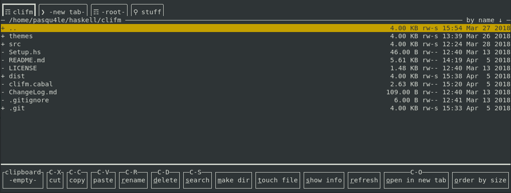

# Command Line Interface File Manager
Clifm is a small file manager written in Haskell with a command line interface. It allows you to explore directories in multiple tabs and perform basic operations.



Note: this is still an experiment and might be unstable. I do not recommend using it as your daily File Manager and I take no responsibility on what you do with it.

## Building and Running
To build clifm, you need [GHC](https://www.haskell.org/ghc/) and [cabal-install](http://hackage.haskell.org/package/cabal-install). Then you can build with:

```
$ cabal build
```
and run the compiled software (should be in `dist/build/clifm/clifm`).

## Features
Clifm is a [brick](https://github.com/jtdaugherty/brick) application, that in turn builds upon [vty](https://github.com/jtdaugherty/vty). As such it supports a large number of terminals, but not on Windows, handles windows resizing and more.

If your terminal supports a mouse you can use it to change tab, click a button on the bottom or change your selection, but only using the keyboard you can perform every possible action. This is the list of all the keybindings:

- UpArrow: move the selection in the current Tab one Item up
- DownArrow: move the selection in the current Tab one Item down
- Ctrl+UpArrow: move the selection in the current Tab to the Item on the top
- Ctrl+DownArrow: move the selection in the current Tab to the Item on the bottom
- Enter: Open the selected directory
- Tab: Move to the next tab
- BackTab: Move to the previous tab
- Ctrl+LeftArrow: Swap current tab's position with the previous one
- Ctrl+RightArrow: Swap current tab's position with the next one
- Esc or Ctrl+q: **Q**uit
- Ctrl+x: Cut the selected Item
- Ctrl+c: Copy the selected Item
- Ctrl+v: Paste in the current Tab's directory
- Ctrl+r: **R**ename the selected Item
- Ctrl+d: **D**elete the selected Item
- Ctrl+a: M**a**ke a new directory
- Ctrl+t: **T**ouch (create an empty) file
- Ctrl+g: **G**o to another directory
- Ctrl+n: Open a **N**ew Tab
- Ctrl+o: **O**pen the selected directory in a New Tab
- Ctrl+l: Re**l**oad the current Tab
- Ctrl+k: **K**ill (close) the current Tab

The actions above will not work only if a prompt is up, or you try to do something not possible.

## TODOs
- treaded IO operations (that do not freeze the UI and can be canceled)
- performance optimizations (especially in the tab rendering)
- support for external text editors
- support for themes
- settings (probably using command line arguments)
